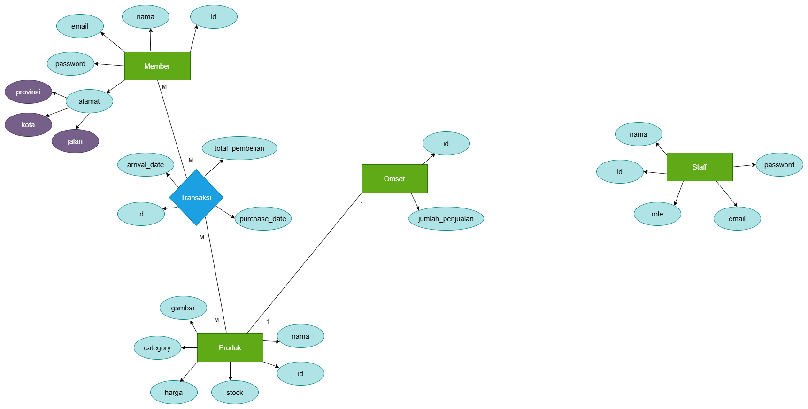

# 🧶 Batik Hub – RESTful API Service


> A production-ready, decoupled RESTful API service built with Java Spring Boot and Spring Data JPA to power the **Batik Hub** Direct-to-Consumer (D2C) marketplace infrastructure.

---

## 📌 Project Overview

This repository represents the decoupled backend API servic of the Batik Hub ecosystem. Originally designed as a monolithic server-side rendered (SSR) application, this service was refactored into a stateless REST API to support multi-client architectures (Single Page Applications, Mobile Apps, and Third-Party Services).

### 🛠️ Architecture & Key Engineering Highlights
- **Decoupled Architecture:** Utilizes `@RestController` returning standardized JSON payloads (`ResponseEntity<T>`).
- **Data Transfer Objects (DTOs):** Encapsulates payload schemas and leverages `Jakarta Validation` to sanitize incoming data without exposing internal JPA `@Entity` structures.
- **Custom JPA Repositories:** Reuses core data access logic for real-time sales aggregation (`jumlahOmset`) and dynamic inventory management (`reduceStock`).
- **Centralized Exception Handling:** Mapped global exception handlers via `@RestControllerAdvice` to ensure uniform JSON error schemas across all routes.
- **RDBMS Normalization:** Strict relational integrity powered by PostgreSQL.

---

## 🏗️ Tech Stack

- **Language:** Java 21
- **Framework:** Spring Boot 4.x
- **Database:** PostgreSQL
- **DevOps & Containerization:** Docker & Docker Compose
---

## 🗄 Database Architecture (ERD)
<p align="center">
  
</p>

The `Member`👥 entity has a **Many-to-Many** relationship with the `Produk`📦 entity because many buyers can buy many products at once. However, I need additional data between these two entities, namely the purchase date📅 and the date the products arrived🚚, so I added a transaction to the ERD, namely `Transaksi`💳. In addition, the relationship between `Produk` and `Omset`📊 is **One-to-One** because one product can only have one in the `Omset` table. If there is a new transaction, the `Omset` table will automatically update through the `Produk` table and there is no need to add new data to the `Omset` table, just update the `jumlah_penjualan` column.

Additionally, I also added a `Staff`👔 table, which isn't related to any other entities. There's no specific reason to add this table. However, I want this application to run according to industry standards, as there will definitely be employees using the application, so a `Staff`👔 table is necessary. The reason this table doesn't have a relationship with any other entities is because there's no corresponding table to relate it to, so I decided to leave this table as a standalone table without any relationships.

## 🔌 API Endpoints Summary

All API endpoints are versioned under the `/api/v1` namespace. For full API documentation specs, please check the `/docs` directory.

### 🛍️ Products (`/api/v1/products`)
| Method | Endpoint | Description | Access |
| :--- | :--- | :--- | :--- |
| `GET` | `/api/v1/products` | Retrieve list of all products | All |
| `GET` | `/api/v1/products/search` | Get product details by their name | All |
| `POST` | `/api/v1/products` | Create a new product listing | Staff/CEO |
| `PATCH` | `/api/v1/products/{id}` | Update existing product details | Staff/CEO |
| `DELETE` | `/api/v1/products/{id}` | Remove a product listing | Staff/CEO |

### 👤 Member (`/api/v1/member`)
| Method | Endpoint | Description | Access |
| :--- | :--- | :--- | :--- |
| `POST` | `/api/v1/member` | Create a new member account | Member |
| `GET` | `/api/v1/member/current` | Get a member account by their token | Member |
| `PATCH` | `/api/v1/member/current` | Update member data account | Member |
| `DELETE` | `/api/v1/member/current` | Remove existing member account | Member |

### 👔 Staff (`/api/v1/staff`)
| Method | Endpoint | Description | Access |
| :--- | :--- | :--- | :--- |
| `POST` | `/api/v1/staff` | Create a new staff account | CEO |
| `GET` | `/api/v1/staff/all` | Show all staff account | CEO |
| `GET` | `/api/v1/staff/current` | Get a staff account by their token | Staff/CEO |
| `PATCH` | `/api/v1/staff/current` | Update staff data account | Staff/CEO |
| `DELETE` | `/api/v1/staff/current` | Remove existing staff account | CEO |

### 👤/👔 User & Staff Auth (`/api/v1/auth`)
| Method | Endpoint | Description | Access |
| :--- | :--- | :--- | :--- |
| `POST` | `/api/v1/auth/login-emailpassword` | Authenticate by email & password. Generate token/session | All |
| `POST` | `/api/v1/auth/login-id` | Authenticate by id. Generate token/session | All |
| `DELETE` | `/api/v1/auth/logout` | Remove their token/session | All |

### 💳 Transactions (`/api/v1/transaction`)
| Method | Endpoint | Description | Access |
| :--- | :--- | :--- | :--- |
| `POST` | `/api/v1/transaction` | Process purchase | Member |
| `DELETE` | `/api/v1/transaction/{id}` | As an indication that the product has arrived | Member |
| `GET` | `/api/v1/transaction/all` | Get all the transaction that is being sent  | Staff/CEO |

### 💵 Omset (`/api/v1/omset`)
| Method | Endpoint | Description | Access |
| :--- | :--- | :--- | :--- |
| `GET` | `/api/v1/omset/dashboard` | Get revenue analytics for all products (omset, omet per product, total sold for each product, total items sold) | Staff/CEO |
---

## 📄 Standardized API Response Format

All API endpoints return data wrapped in a uniform JSON structure:

```json
{
  "code": 200,
  "data": { },
  "error" : "",
  "paging" : {
        "currentPage": 0,
        "totalPage": 5,
        "size": 6,
        "totalElements": 30
    }
}